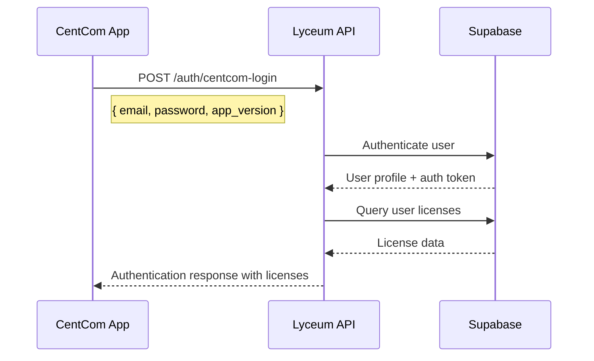

# CentCom Enhanced License System Integration Guide

## Overview

This document provides the CentCom development team with comprehensive guidance on integrating with the new enhanced license system. The system now supports granular feature control, version-based compatibility, and separate licensing for main applications and plugins.

## 🔐 Authentication & License Retrieval Flow

### 1. User Authentication Process



### 2. License Data Retrieval

After successful authentication, CentCom will receive a comprehensive license object containing all necessary permissions and configurations.

## 🛠️ API Integration

### Authentication Endpoint

**POST** `/api/auth/centcom-login`

**Request Headers:**
```http
Content-Type: application/json
User-Agent: CentCom/1.0.3 (Windows NT 10.0; Win64; x64)
X-Client-Version: 1.0.3
```

**Request Body:**
```json
{
  "email": "user@company.com",
  "password": "userPassword",
  "app_version": "1.0.3",
  "client_info": {
    "app_name": "CentCom",
    "platform": "windows",
    "build_number": "2024.12.001",
    "os_version": "Windows 10",
    "machine_id": "unique-machine-identifier"
  }
}
```

**Response:**
```json
{
  "success": true,
  "user": {
    "id": "user-uuid",
    "email": "user@company.com",
    "profile": {
      "first_name": "John",
      "last_name": "Doe",
      "company": "Audio Corp",
      "role": "engineer"
    }
  },
  "session_token": "jwt-session-token",
  "licenses": [
    {
      "id": "license-uuid",
      "key_code": "CENTCOM-PRO-2024-ABC123",
      "license_category": "main_application",
      "license_type": "professional",
      "status": "active",
      "main_app_version": "1.0.3",
      "main_app_permissions": {
        "test_data": true,
        "data_visualization": true,
        "analytics_studio": true,
        "sequencer": true,
        "assets": true,
        "settings": true
      },
      "feature_configurations": {
        "data_visualization": {
          "save_limits_to_projects": true,
          "max_flagged_measurements": 500,
          "auto_flagger_enabled": true,
          "export_raw_data": true,
          "custom_visualization_templates": true
        },
        "test_data": {
          "max_concurrent_tests": 10,
          "batch_processing": true,
          "data_retention_days": 365,
          "custom_test_protocols": true
        },
        "analytics_studio": {
          "advanced_algorithms": true,
          "custom_reports": true,
          "api_access": true,
          "data_export_formats": ["pdf", "excel", "csv", "json", "xml"],
          "real_time_analysis": true
        }
      },
      "usage_limits": {
        "max_users": 50,
        "max_projects": 200,
        "max_storage_gb": 100
      },
      "license_config": {
        "api_rate_limit": 500,
        "concurrent_sessions": 10,
        "priority_support": true,
        "sla_hours": 24
      },
      "expires_at": "2025-12-31T23:59:59Z"
    }
  ],
  "plugins": [
    {
      "id": "plugin-uuid",
      "key_code": "PLUGIN-STA-2024-DEF456",
      "license_category": "plugin",
      "plugin_id": "klippel-qc",
      "plugin_name": "Klippel QC",
      "plugin_version": "2.1.0",
      "features": ["automated_testing", "custom_test_protocols", "batch_processing"],
      "plugin_tier": "standard",
      "tier_limits": {
        "max_tests_per_day": 100,
        "parallel_processing": false,
        "custom_protocols": 5
      }
    }
  ]
}
```

## 📋 License Structure Reference

### Main Application License Fields

| Field | Type | Description |
|-------|------|-------------|
| `license_category` | string | Always "main_application" for CentCom licenses |
| `license_type` | string | "trial", "standard", "professional", or "enterprise" |
| `main_app_version` | string | Licensed version (e.g., "1.0.3") |
| `main_app_permissions` | object | Module-level permissions |
| `feature_configurations` | object | Granular feature settings per module |
| `usage_limits` | object | User, project, and storage limits |

### Plugin License Fields

| Field | Type | Description |
|-------|------|-------------|
| `license_category` | string | Always "plugin" for plugin licenses |
| `plugin_id` | string | Plugin identifier ("klippel-qc", "apx500") |
| `plugin_name` | string | Human-readable plugin name |
| `plugin_version` | string | Licensed plugin version |
| `features` | array | Enabled plugin features |
| `plugin_tier` | string | Plugin license tier |
| `tier_limits` | object | Plugin-specific usage limits |

## 🔍 Implementation Guidelines

### 1. Version Compatibility Checking

CentCom should validate version compatibility on startup:

```javascript
function validateVersionCompatibility(userAppVersion, licenseVersion) {
  const parseVersion = (v) => v.split('.').map(n => parseInt(n));
  const userVer = parseVersion(userAppVersion);
  const licenseVer = parseVersion(licenseVersion);
  
  // License grants access to specified version and all previous versions
  for (let i = 0; i < Math.max(userVer.length, licenseVer.length); i++) {
    const userPart = userVer[i] || 0;
    const licensePart = licenseVer[i] || 0;
    
    if (userPart > licensePart) return false;
    if (userPart < licensePart) return true;
  }
  return true; // Versions are equal
}

// Example usage
const isCompatible = validateVersionCompatibility("1.0.2", "1.0.3"); // true
const isCompatible = validateVersionCompatibility("1.0.4", "1.0.3"); // false
```

### 2. Module Permission Validation

Check if user has access to specific CentCom modules:

```javascript
function hasModuleAccess(license, moduleName) {
  // Check if license is active
  if (license.status !== 'active') return false;
  
  // Check expiration
  if (license.expires_at && new Date(license.expires_at) < new Date()) return false;
  
  // Check module permission
  return license.main_app_permissions?.[moduleName] === true;
}

// Example usage
const canAccessTestData = hasModuleAccess(license, 'test_data');
const canAccessAnalytics = hasModuleAccess(license, 'analytics_studio');
```

### 3. Feature-Level Authorization

Validate specific features within modules:

```javascript
function hasFeatureAccess(license, moduleName, featureName) {
  // First check module access
  if (!hasModuleAccess(license, moduleName)) return false;
  
  // Check feature configuration stored in license_config
  const licenseConfig = license.license_config || {};
  const moduleConfig = licenseConfig.feature_configurations?.[moduleName];
  if (!moduleConfig) return false;
  
  return moduleConfig[featureName] === true;
}

// Get numeric limit values (null = unlimited)
function getFeatureLimit(license, moduleName, limitName) {
  const licenseConfig = license.license_config || {};
  const moduleConfig = licenseConfig.feature_configurations?.[moduleName];
  if (!moduleConfig) return null;
  
  const limit = moduleConfig[limitName];
  return limit === null ? -1 : limit; // -1 represents unlimited
}

// Example usage
const canUseAutoFlagger = hasFeatureAccess(license, 'data_visualization', 'auto_flagger_enabled');
const canUseBatchProcessing = hasFeatureAccess(license, 'test_data', 'batch_processing');
const maxConcurrentTests = getFeatureLimit(license, 'test_data', 'max_concurrent_tests');
const maxFlaggedMeasurements = getFeatureLimit(license, 'data_visualization', 'max_flagged_measurements');

// Check data export formats for Analytics Studio
function getExportFormats(license) {
  const licenseConfig = license.license_config || {};
  const analyticsConfig = licenseConfig.feature_configurations?.analytics_studio;
  return analyticsConfig?.data_export_formats || ['pdf']; // Default to PDF only
}
```

### 4. Granular Feature Permission Examples

Here are specific examples for each CentCom application:

#### Data Visualization Permissions
```javascript
// Check if user can use auto-flagger
const canUseAutoFlagger = hasFeatureAccess(license, 'data_visualization', 'auto_flagger_enabled');

// Check if user can save limits to projects  
const canSaveLimitsToProjects = hasFeatureAccess(license, 'data_visualization', 'save_limits_to_projects');

// Get maximum flagged measurements allowed
const maxFlagged = getFeatureLimit(license, 'data_visualization', 'max_flagged_measurements');
if (maxFlagged > 0 && currentFlaggedCount >= maxFlagged) {
  // Prevent creating more flagged measurements
  showLimitReachedDialog('flagged_measurements', currentFlaggedCount, maxFlagged);
  return false;
}

// Check export permissions
const canExportRawData = hasFeatureAccess(license, 'data_visualization', 'export_raw_data');
```

#### Test Data Permissions
```javascript
// Check if batch processing is allowed
const canUseBatchProcessing = hasFeatureAccess(license, 'test_data', 'batch_processing');

// Check concurrent test limits
const maxConcurrentTests = getFeatureLimit(license, 'test_data', 'max_concurrent_tests');
if (maxConcurrentTests > 0 && activeTestCount >= maxConcurrentTests) {
  // Prevent starting new test
  showLimitReachedDialog('concurrent_tests', activeTestCount, maxConcurrentTests);
  return false;
}

// Check data retention policy
const retentionDays = getFeatureLimit(license, 'test_data', 'data_retention_days');
if (retentionDays > 0) {
  // Implement automatic data cleanup after retention period
  cleanupOldTestData(retentionDays);
}
```

#### Analytics Studio Permissions
```javascript
// Check if advanced algorithms are enabled
const canUseAdvancedAlgorithms = hasFeatureAccess(license, 'analytics_studio', 'advanced_algorithms');
if (canUseAdvancedAlgorithms) {
  // Show advanced algorithm options in UI
  showAdvancedAlgorithmsPanel();
}

// Check real-time analysis capability
const hasRealTimeAnalysis = hasFeatureAccess(license, 'analytics_studio', 'real_time_analysis');

// Get available export formats
const exportFormats = getExportFormats(license);
// exportFormats might be ['pdf', 'excel', 'csv', 'json', 'xml']
populateExportFormatDropdown(exportFormats);
```

### 5. Usage Limit Enforcement

Track and enforce usage limits:

```javascript
function checkUsageLimits(license, currentUsage) {
  const limits = license.usage_limits;
  const violations = [];
  
  // Check concurrent tests for test_data module
  const testDataConfig = license.feature_configurations?.test_data;
  if (testDataConfig?.max_concurrent_tests !== null) {
    if (currentUsage.concurrent_tests > testDataConfig.max_concurrent_tests) {
      violations.push({
        type: 'concurrent_tests',
        limit: testDataConfig.max_concurrent_tests,
        current: currentUsage.concurrent_tests
      });
    }
  }
  
  // Check flagged measurements for data_visualization
  const vizConfig = license.feature_configurations?.data_visualization;
  if (vizConfig?.max_flagged_measurements !== null) {
    if (currentUsage.flagged_measurements > vizConfig.max_flagged_measurements) {
      violations.push({
        type: 'flagged_measurements',
        limit: vizConfig.max_flagged_measurements,
        current: currentUsage.flagged_measurements
      });
    }
  }
  
  return violations;
}
```

## 🔌 Plugin Integration

### Plugin License Validation

```javascript
function validatePluginLicense(pluginId, userPluginLicenses) {
  const pluginLicense = userPluginLicenses.find(p => p.plugin_id === pluginId);
  
  if (!pluginLicense) {
    return { valid: false, reason: 'No license found for plugin' };
  }
  
  if (pluginLicense.status !== 'active') {
    return { valid: false, reason: 'Plugin license is not active' };
  }
  
  if (pluginLicense.expires_at && new Date(pluginLicense.expires_at) < new Date()) {
    return { valid: false, reason: 'Plugin license has expired' };
  }
  
  return { 
    valid: true, 
    license: pluginLicense,
    features: pluginLicense.features || [],
    tier_limits: pluginLicense.tier_limits || {}
  };
}
```

## 📊 License Types & Default Configurations

### Trial License (30 days)
```javascript
const trialDefaults = {
  max_users: 1,
  max_projects: 5,
  max_storage_gb: 1,
  modules: ['test_data', 'data_visualization'],
  features: {
    data_visualization: {
      max_flagged_measurements: 10,
      auto_flagger_enabled: false,
      save_limits_to_projects: false
    },
    test_data: {
      max_concurrent_tests: 1,
      batch_processing: false,
      data_retention_days: 7
    }
  }
};
```

### Standard License
```javascript
const standardDefaults = {
  max_users: 10,
  max_projects: 50,
  max_storage_gb: 25,
  modules: ['test_data', 'data_visualization', 'analytics_studio', 'assets'],
  features: {
    data_visualization: {
      max_flagged_measurements: 100,
      auto_flagger_enabled: true,
      save_limits_to_projects: true
    },
    test_data: {
      max_concurrent_tests: 3,
      batch_processing: true,
      data_retention_days: 90
    }
  }
};
```

### Professional License
```javascript
const professionalDefaults = {
  max_users: 50,
  max_projects: 200,
  max_storage_gb: 100,
  modules: ['test_data', 'data_visualization', 'analytics_studio', 'sequencer', 'assets', 'settings'],
  features: {
    data_visualization: {
      max_flagged_measurements: 500,
      auto_flagger_enabled: true,
      save_limits_to_projects: true,
      custom_visualization_templates: true
    },
    analytics_studio: {
      advanced_algorithms: true,
      real_time_analysis: true
    }
  }
};
```

### Enterprise License
```javascript
const enterpriseDefaults = {
  max_users: -1, // unlimited
  max_projects: -1, // unlimited  
  max_storage_gb: -1, // unlimited
  modules: ['test_data', 'data_visualization', 'analytics_studio', 'sequencer', 'assets', 'settings'],
  features: {
    // All features enabled with no limits (null values = unlimited)
    data_visualization: {
      max_flagged_measurements: null,
      auto_flagger_enabled: true,
      save_limits_to_projects: true,
      custom_visualization_templates: true
    },
    test_data: {
      max_concurrent_tests: null,
      batch_processing: true,
      data_retention_days: null
    }
  }
};
```

## 🚨 Error Handling

### Common License Validation Errors

```javascript
const LicenseErrors = {
  NO_LICENSE: 'No valid license found',
  EXPIRED: 'License has expired',
  VERSION_MISMATCH: 'App version not supported by license',
  MODULE_DENIED: 'Module access denied by license',
  FEATURE_DENIED: 'Feature access denied by license',
  USAGE_LIMIT_EXCEEDED: 'Usage limit exceeded',
  PLUGIN_NOT_LICENSED: 'Plugin not licensed for this user'
};

function handleLicenseError(errorType, details = {}) {
  console.error(`License Error: ${errorType}`, details);
  
  switch(errorType) {
    case LicenseErrors.NO_LICENSE:
      // Show license purchase/trial flow
      showLicenseAcquisitionFlow();
      break;
      
    case LicenseErrors.EXPIRED:
      // Show license renewal flow
      showLicenseRenewalFlow(details.licenseId);
      break;
      
    case LicenseErrors.VERSION_MISMATCH:
      // Suggest license upgrade or app downgrade
      showVersionCompatibilityError(details.appVersion, details.licenseVersion);
      break;
      
    case LicenseErrors.USAGE_LIMIT_EXCEEDED:
      // Show usage limit dialog with upgrade options
      showUsageLimitDialog(details.limitType, details.current, details.max);
      break;
      
    default:
      // Generic error dialog
      showGenericLicenseError(errorType, details);
  }
}
```

## 🔄 License Refresh & Caching

### Recommended Caching Strategy

```javascript
class LicenseManager {
  constructor() {
    this.licenseCache = null;
    this.lastFetch = null;
    this.cacheTimeout = 15 * 60 * 1000; // 15 minutes
  }
  
  async getLicenses(forceRefresh = false) {
    const now = Date.now();
    
    // Return cached licenses if valid
    if (!forceRefresh && 
        this.licenseCache && 
        this.lastFetch && 
        (now - this.lastFetch) < this.cacheTimeout) {
      return this.licenseCache;
    }
    
    try {
      const response = await fetch('/api/user-profiles/licenses', {
        headers: {
          'Authorization': `Bearer ${this.sessionToken}`,
          'X-App-Version': this.appVersion
        }
      });
      
      if (response.ok) {
        this.licenseCache = await response.json();
        this.lastFetch = now;
        return this.licenseCache;
      }
    } catch (error) {
      console.error('Failed to refresh licenses:', error);
      // Return cached data if available, even if stale
      return this.licenseCache;
    }
  }
  
  // Call this when license changes are detected
  invalidateCache() {
    this.licenseCache = null;
    this.lastFetch = null;
  }
}
```

## 📈 Usage Tracking & Reporting

### Track License Usage

CentCom should periodically report usage statistics:

```javascript
async function reportUsageStats(licenseId, stats) {
  try {
    await fetch('/api/licenses/usage-stats', {
      method: 'POST',
      headers: {
        'Content-Type': 'application/json',
        'Authorization': `Bearer ${sessionToken}`
      },
      body: JSON.stringify({
        license_id: licenseId,
        timestamp: new Date().toISOString(),
        stats: {
          concurrent_tests: stats.activeConcurrentTests,
          flagged_measurements: stats.totalFlaggedMeasurements,
          projects_active: stats.activeProjectCount,
          storage_used_gb: stats.storageUsedGB,
          daily_api_calls: stats.dailyApiCalls,
          features_used: stats.featuresUsedToday
        }
      })
    });
  } catch (error) {
    console.warn('Failed to report usage stats:', error);
  }
}
```

## ✅ Implementation Checklist

### Phase 1: Basic Integration
- [ ] Update authentication flow to retrieve license data
- [ ] Implement version compatibility checking
- [ ] Add module-level permission validation
- [ ] Handle license expiration gracefully

### Phase 2: Feature Controls
- [ ] Implement feature-level authorization
- [ ] Add usage limit enforcement
- [ ] Create user-friendly error messages
- [ ] Add license status indicators in UI

### Phase 3: Advanced Features
- [ ] Plugin license validation
- [ ] Usage tracking and reporting
- [ ] License caching with refresh logic
- [ ] Offline license validation (cached)

### Phase 4: Testing & Monitoring
- [ ] Test all license types and scenarios
- [ ] Test version compatibility edge cases
- [ ] Add license validation logging
- [ ] Monitor license API performance

## 🔗 API Endpoints Reference

| Endpoint | Method | Purpose | Auth Required |
|----------|---------|---------|---------------|
| `/api/auth/centcom-login` | POST | Authenticate and get licenses | No |
| `/api/user-profiles/licenses` | GET | Refresh license data | Yes |
| `/api/licenses/validate` | POST | Validate specific license | Yes |
| `/api/licenses/usage-stats` | POST | Report usage statistics | Yes |
| `/api/auth/refresh-session` | POST | Refresh authentication token | Yes |
| `/api/auth/centcom-logout` | POST | Log out and invalidate session | Yes |

### Authentication Headers

For authenticated requests, include:
```http
Authorization: Bearer <session_token>
X-App-Version: 1.0.3
X-License-Key: <primary_license_key>
```

## 🆘 Support & Troubleshooting

### Common Issues

1. **License Not Loading**
   - Check authentication token validity
   - Verify API endpoint accessibility
   - Check license assignment in admin panel

2. **Version Compatibility Issues**
   - Ensure version strings follow semver format
   - Check license version vs app version
   - Verify backwards compatibility logic

3. **Feature Access Denied**
   - Confirm module permissions are enabled
   - Check feature configuration values
   - Verify license type supports feature

4. **Plugin License Issues**
   - Ensure plugin license is assigned
   - Check plugin ID matches exactly
   - Verify plugin version compatibility

### License Refresh Flow

CentCom should implement automatic license refresh:

```javascript
class SessionManager {
  async refreshLicenseData() {
    try {
      const response = await fetch('/api/user-profiles/licenses', {
        headers: {
          'Authorization': `Bearer ${this.sessionToken}`,
          'X-App-Version': this.appVersion,
          'X-License-Key': this.primaryLicenseKey
        }
      });
      
      if (response.status === 401) {
        // Session expired, need to re-authenticate
        await this.handleSessionExpired();
        return;
      }
      
      if (response.ok) {
        const licenseData = await response.json();
        this.updateLicenseCache(licenseData);
        this.notifyLicenseUpdate(licenseData);
      }
    } catch (error) {
      console.error('License refresh failed:', error);
      this.handleLicenseRefreshError(error);
    }
  }
  
  async handleSessionExpired() {
    // Clear cached data
    this.clearCache();
    
    // Redirect to login or show re-authentication dialog
    this.showReauthenticationDialog();
  }
}
```

### Offline License Validation

For offline scenarios, implement license caching:

```javascript
class OfflineLicenseManager {
  constructor() {
    this.cachedLicense = this.loadFromLocalStorage();
    this.offlineGracePeriod = 7 * 24 * 60 * 60 * 1000; // 7 days
  }
  
  canWorkOffline() {
    if (!this.cachedLicense) return false;
    
    const lastSync = new Date(this.cachedLicense.last_sync);
    const now = new Date();
    
    return (now - lastSync) < this.offlineGracePeriod;
  }
  
  validateOfflineLicense(moduleName) {
    if (!this.canWorkOffline()) {
      throw new Error('Offline license expired. Please connect to internet.');
    }
    
    return this.cachedLicense.main_app_permissions?.[moduleName] === true;
  }
}
```

For technical support, contact the Lyceum team with:
- User email and license key
- CentCom version and build number
- Error messages and logs
- Steps to reproduce the issue
- Network connectivity status
- Last successful license sync timestamp

---

**Version:** 2.2  
**Last Updated:** December 2024  
**Next Review:** Q1 2025
