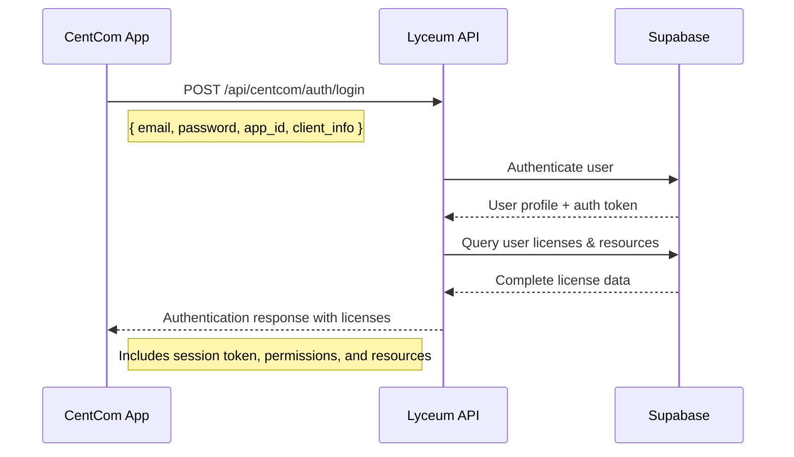
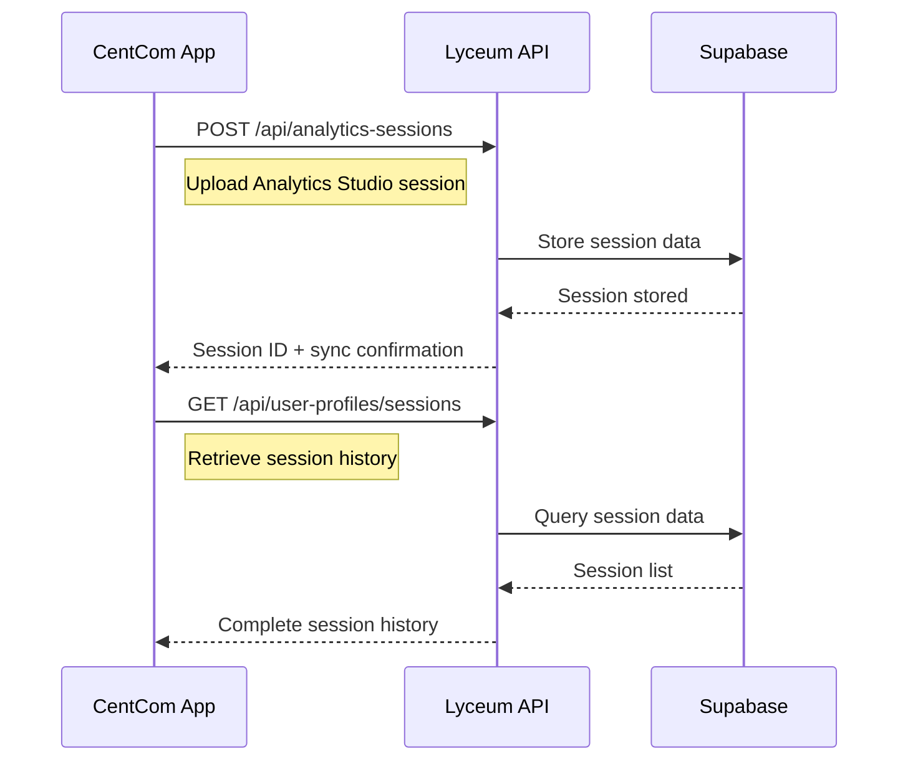

# CentCom Enhanced License System Integration Guide

## Overview

This document provides the CentCom development team with comprehensive guidance on integrating with the enhanced license system. The system supports granular feature control, version-based compatibility, separate licensing for main applications and plugins, and bidirectional session synchronization with Lyceum.

## 🔐 Authentication & License Retrieval Flow

### 1. User Authentication Process



### 2. Session Synchronization Flow



## 🛠️ API Integration

### Authentication Endpoint

**POST** `/api/centcom/auth/login`

**Request Headers:**
```http
Content-Type: application/json
User-Agent: CentCom/2.1.0 (Windows NT 10.0; Win64; x64)
X-Client-Version: 2.1.0
```

**Request Body:**
```json
{
  "email": "user@company.com",
  "password": "userPassword",
  "app_id": "centcom",
  "client_info": {
    "app_name": "CentCom",
    "version": "2.1.0",
    "platform": "windows",
    "build_number": "2024.12.001",
    "os_version": "Windows 10",
    "machine_id": "unique-machine-identifier",
    "user_agent": "CentCom/2.1.0 (Windows NT 10.0; Win64; x64)"
  }
}
```

**Response:**
```json
{
  "success": true,
  "user": {
    "id": "user-uuid",
    "email": "user@company.com",
    "username": "user_name",
    "roles": ["user", "engineer"],
    "license_type": "professional",
    "security_clearance": "internal",
    "organization": "Audio Corp"
  },
  "session": {
    "access_token": "jwt-session-token",
    "expires_at": "2025-01-02T00:00:00Z",
    "permissions": ["project_create", "data_analysis", "export_data"]
  },
  "licenses": [
    {
      "id": "license-uuid",
      "key_code": "CENTCOM-PRO-2024-ABC123",
      "license_category": "main_application",
      "license_type": "professional",
      "status": "active",
      "main_app_version": "2.1.0",
      "main_app_permissions": {
        "test_data": true,
        "data_visualization": true,
        "analytics_studio": true,
        "sequencer": true,
        "assets": true,
        "settings": true
      },
      "feature_configurations": {
        "data_visualization": {
          "save_limits_to_projects": true,
          "max_flagged_measurements": 500,
          "auto_flagger_enabled": true,
          "export_raw_data": true,
          "custom_visualization_templates": true
        },
        "test_data": {
          "max_concurrent_tests": 10,
          "batch_processing": true,
          "data_retention_days": 365,
          "custom_test_protocols": true
        },
        "analytics_studio": {
          "advanced_algorithms": true,
          "custom_reports": true,
          "api_access": true,
          "data_export_formats": ["pdf", "excel", "csv", "json", "xml"],
          "real_time_analysis": true
        }
      },
      "usage_limits": {
        "max_users": 50,
        "max_projects": 200,
        "max_storage_gb": 100
      },
      "license_config": {
        "api_rate_limit": 500,
        "concurrent_sessions": 10,
        "priority_support": true,
        "sla_hours": 24
      },
      "expires_at": "2025-12-31T23:59:59Z"
    }
  ],
  "plugins": [
    {
      "id": "plugin-uuid",
      "key_code": "PLUGIN-STA-2024-DEF456",
      "license_category": "plugin",
      "plugin_id": "klippel-qc",
      "plugin_name": "Klippel QC",
      "plugin_version": "2.1.0",
      "features": ["automated_testing", "custom_test_protocols", "batch_processing"],
      "plugin_tier": "standard",
      "tier_limits": {
        "max_tests_per_day": 100,
        "parallel_processing": false,
        "custom_protocols": 5
      }
    }
  ],
  "resources": {
    "storage_used_mb": 1024,
    "storage_limit_mb": 10240,
    "bandwidth_used_mb": 512,
    "bandwidth_limit_mb": 51200,
    "api_calls_count": 1500,
    "api_calls_limit": 10000,
    "compute_hours_used": 25,
    "compute_hours_limit": 100
  },
  "clusters": [
    {
      "id": "cluster_id",
      "cluster_name": "Production DB",
      "cluster_type": "postgresql",
      "status": "active",
      "region": "us-east-1",
      "storage_size_mb": 10240
    }
  ]
}
```

### Analytics Studio Session Integration

**POST** `/api/analytics-sessions`

Upload Analytics Studio sessions from CentCom to Lyceum for cloud synchronization.

**Request Headers:**
```http
Content-Type: application/json
Authorization: Bearer jwt-session-token
X-Client-Version: 2.1.0
X-App-Source: centcom
```

**Request Body:**
```json
{
  "name": "Frequency Response Analysis",
  "description": "Production unit testing analysis",
  "session_type": "exploratory",
  "data_bindings": {
    "primary_dataset": "production_batch_001",
    "reference_data": "golden_reference_v2",
    "measurement_setup": {
      "frequency_range": [20, 20000],
      "sample_rate": 48000,
      "measurement_duration": 60
    }
  },
  "analytics_state": {
    "current_view": "frequency_domain",
    "filters_applied": ["high_pass_20hz", "notch_60hz"],
    "analysis_algorithms": ["fft_analysis", "thd_calculation"],
    "visualization_settings": {
      "plot_type": "magnitude_phase",
      "axis_scaling": "log_frequency",
      "color_scheme": "viridis"
    }
  },
  "collaboration": {
    "shared_with": [],
    "permissions": "private",
    "comments": [],
    "annotations": []
  },
  "config": {
    "auto_save_interval": 300,
    "backup_enabled": true,
    "export_preferences": {
      "default_format": "pdf",
      "include_raw_data": true,
      "compression_level": "medium"
    }
  }
}
```

**Response:**
```json
{
  "success": true,
  "session": {
    "id": "session-uuid",
    "name": "Frequency Response Analysis",
    "status": "active",
    "created_at": "2025-01-01T12:00:00Z",
    "last_modified": "2025-01-01T12:00:00Z",
    "sync_status": "synchronized",
    "lyceum_url": "https://thelyceum.io/analytics-studio/session/session-uuid"
  },
  "sync_info": {
    "uploaded_size_mb": 2.5,
    "compression_ratio": 0.3,
    "backup_created": true,
    "sync_timestamp": "2025-01-01T12:00:00Z"
  }
}
```

### Session History Retrieval

**GET** `/api/user-profiles/sessions?filterType=centcom-sessions`

Retrieve user's CentCom session history for synchronization.

**Request Headers:**
```http
Authorization: Bearer jwt-session-token
X-Client-Version: 2.1.0
```

**Response:**
```json
{
  "success": true,
  "sessions": [
    {
      "id": "session-uuid",
      "name": "Frequency Response Analysis",
      "type": "centcom_session",
      "session_type": "exploratory",
      "application_source": "centcom",
      "created_at": "2025-01-01T12:00:00Z",
      "last_modified": "2025-01-01T12:05:00Z",
      "status": "synchronized",
      "size_mb": 2.5,
      "collaboration_count": 0,
      "download_url": "/api/analytics-sessions/session-uuid/download"
    }
  ],
  "total_count": 15,
  "centcom_sessions_count": 8,
  "web_sessions_count": 7,
  "total_storage_mb": 45.2
}
```

### Session Validation & Token Refresh

**POST** `/api/centcom/auth/validate`

Validate current session and refresh authentication token.

**Request Body:**
```json
{
  "session_token": "jwt-session-token",
  "user_id": "user-uuid"
}
```

**Response:**
```json
{
  "success": true,
  "valid": true,
  "user": {
    "id": "user-uuid",
    "email": "user@company.com",
    "username": "user_name",
    "roles": ["user", "engineer"],
    "is_active": true
  },
  "session": {
    "expires_at": "2025-01-02T00:00:00Z",
    "refresh_token": "new-jwt-session-token",
    "time_remaining_minutes": 1440
  },
  "permissions": {
    "can_access_centcom": true,
    "plugins": ["general", "klippel_qc"],
    "role_permissions": ["project_create", "data_analysis", "export_data"]
  }
}
```

## 📋 License Structure Reference

### Main Application License Fields

| Field | Type | Description |
|-------|------|-------------|
| `license_category` | string | Always "main_application" for CentCom licenses |
| `license_type` | string | "trial", "standard", "professional", or "enterprise" |
| `main_app_version` | string | Licensed version (e.g., "1.0.3") |
| `main_app_permissions` | object | Module-level permissions |
| `feature_configurations` | object | Granular feature settings per module |
| `usage_limits` | object | User, project, and storage limits |

### Plugin License Fields

| Field | Type | Description |
|-------|------|-------------|
| `license_category` | string | Always "plugin" for plugin licenses |
| `plugin_id` | string | Plugin identifier ("klippel-qc", "apx500") |
| `plugin_name` | string | Human-readable plugin name |
| `plugin_version` | string | Licensed plugin version |
| `features` | array | Enabled plugin features |
| `plugin_tier` | string | Plugin license tier |
| `tier_limits` | object | Plugin-specific usage limits |

## 🔍 Implementation Guidelines

### 1. Version Compatibility Checking

CentCom should validate version compatibility on startup:

```javascript
function validateVersionCompatibility(userAppVersion, licenseVersion) {
  const parseVersion = (v) => v.split('.').map(n => parseInt(n));
  const userVer = parseVersion(userAppVersion);
  const licenseVer = parseVersion(licenseVersion);
  
  // License grants access to specified version and all previous versions
  for (let i = 0; i < Math.max(userVer.length, licenseVer.length); i++) {
    const userPart = userVer[i] || 0;
    const licensePart = licenseVer[i] || 0;
    
    if (userPart > licensePart) return false;
    if (userPart < licensePart) return true;
  }
  return true; // Versions are equal
}

// Example usage
const isCompatible = validateVersionCompatibility("1.0.2", "1.0.3"); // true
const isCompatible = validateVersionCompatibility("1.0.4", "1.0.3"); // false
```

### 2. Module Permission Validation

Check if user has access to specific CentCom modules:

```javascript
function hasModuleAccess(license, moduleName) {
  // Check if license is active
  if (license.status !== 'active') return false;
  
  // Check expiration
  if (license.expires_at && new Date(license.expires_at) < new Date()) return false;
  
  // Check module permission
  return license.main_app_permissions?.[moduleName] === true;
}

// Example usage
const canAccessTestData = hasModuleAccess(license, 'test_data');
const canAccessAnalytics = hasModuleAccess(license, 'analytics_studio');
```

### 3. Feature-Level Authorization

Validate specific features within modules:

```javascript
function hasFeatureAccess(license, moduleName, featureName) {
  // First check module access
  if (!hasModuleAccess(license, moduleName)) return false;
  
  // Check feature configuration stored in license_config
  const licenseConfig = license.license_config || {};
  const moduleConfig = licenseConfig.feature_configurations?.[moduleName];
  if (!moduleConfig) return false;
  
  return moduleConfig[featureName] === true;
}

// Get numeric limit values (null = unlimited)
function getFeatureLimit(license, moduleName, limitName) {
  const licenseConfig = license.license_config || {};
  const moduleConfig = licenseConfig.feature_configurations?.[moduleName];
  if (!moduleConfig) return null;
  
  const limit = moduleConfig[limitName];
  return limit === null ? -1 : limit; // -1 represents unlimited
}

// Example usage
const canUseAutoFlagger = hasFeatureAccess(license, 'data_visualization', 'auto_flagger_enabled');
const canUseBatchProcessing = hasFeatureAccess(license, 'test_data', 'batch_processing');
const maxConcurrentTests = getFeatureLimit(license, 'test_data', 'max_concurrent_tests');
const maxFlaggedMeasurements = getFeatureLimit(license, 'data_visualization', 'max_flagged_measurements');

// Check data export formats for Analytics Studio
function getExportFormats(license) {
  const licenseConfig = license.license_config || {};
  const analyticsConfig = licenseConfig.feature_configurations?.analytics_studio;
  return analyticsConfig?.data_export_formats || ['pdf']; // Default to PDF only
}
```

### 4. Granular Feature Permission Examples

Here are specific examples for each CentCom application:

#### Data Visualization Permissions
```javascript
// Check if user can use auto-flagger
const canUseAutoFlagger = hasFeatureAccess(license, 'data_visualization', 'auto_flagger_enabled');

// Check if user can save limits to projects  
const canSaveLimitsToProjects = hasFeatureAccess(license, 'data_visualization', 'save_limits_to_projects');

// Get maximum flagged measurements allowed
const maxFlagged = getFeatureLimit(license, 'data_visualization', 'max_flagged_measurements');
if (maxFlagged > 0 && currentFlaggedCount >= maxFlagged) {
  // Prevent creating more flagged measurements
  showLimitReachedDialog('flagged_measurements', currentFlaggedCount, maxFlagged);
  
  // Track usage attempt for analytics
  await trackResourceUsage('flagged_measurements', 1, 'attempted_exceeded');
  return false;
}

// Check export permissions
const canExportRawData = hasFeatureAccess(license, 'data_visualization', 'export_raw_data');

// Example: Save visualization session to Lyceum
async function saveVisualizationSession(sessionData) {
  if (!canSaveLimitsToProjects) {
    showUpgradePrompt('Session saving requires Standard license or higher');
    return;
  }
  
  try {
    // Upload session to Lyceum
    const result = await lyceumClient.uploadSession({
      name: sessionData.name,
      description: 'Data visualization session',
      session_type: 'exploratory',
      data_bindings: sessionData.dataBindings,
      analytics_state: sessionData.visualizationState,
      collaboration: { permissions: 'private' },
      config: sessionData.config
    });
    
    if (result.success) {
      // Track successful session upload
      await trackResourceUsage('storage', sessionData.sizeMB, 'add');
      showNotification(`Session saved to Lyceum: ${result.sessionId}`);
    }
  } catch (error) {
    console.error('Failed to save session:', error);
  }
}
```

#### Test Data Permissions
```javascript
// Check if batch processing is allowed
const canUseBatchProcessing = hasFeatureAccess(license, 'test_data', 'batch_processing');

// Check concurrent test limits
const maxConcurrentTests = getFeatureLimit(license, 'test_data', 'max_concurrent_tests');
if (maxConcurrentTests > 0 && activeTestCount >= maxConcurrentTests) {
  // Prevent starting new test
  showLimitReachedDialog('concurrent_tests', activeTestCount, maxConcurrentTests);
  return false;
}

// Check data retention policy
const retentionDays = getFeatureLimit(license, 'test_data', 'data_retention_days');
if (retentionDays > 0) {
  // Implement automatic data cleanup after retention period
  cleanupOldTestData(retentionDays);
}
```

#### Analytics Studio Permissions
```javascript
// Check if advanced algorithms are enabled
const canUseAdvancedAlgorithms = hasFeatureAccess(license, 'analytics_studio', 'advanced_algorithms');
if (canUseAdvancedAlgorithms) {
  // Show advanced algorithm options in UI
  showAdvancedAlgorithmsPanel();
}

// Check real-time analysis capability
const hasRealTimeAnalysis = hasFeatureAccess(license, 'analytics_studio', 'real_time_analysis');

// Get available export formats
const exportFormats = getExportFormats(license);
// exportFormats might be ['pdf', 'excel', 'csv', 'json', 'xml']
populateExportFormatDropdown(exportFormats);
```

### 5. Usage Limit Enforcement

Track and enforce usage limits:

```javascript
function checkUsageLimits(license, currentUsage) {
  const limits = license.usage_limits;
  const violations = [];
  
  // Check concurrent tests for test_data module
  const testDataConfig = license.feature_configurations?.test_data;
  if (testDataConfig?.max_concurrent_tests !== null) {
    if (currentUsage.concurrent_tests > testDataConfig.max_concurrent_tests) {
      violations.push({
        type: 'concurrent_tests',
        limit: testDataConfig.max_concurrent_tests,
        current: currentUsage.concurrent_tests
      });
    }
  }
  
  // Check flagged measurements for data_visualization
  const vizConfig = license.feature_configurations?.data_visualization;
  if (vizConfig?.max_flagged_measurements !== null) {
    if (currentUsage.flagged_measurements > vizConfig.max_flagged_measurements) {
      violations.push({
        type: 'flagged_measurements',
        limit: vizConfig.max_flagged_measurements,
        current: currentUsage.flagged_measurements
      });
    }
  }
  
  return violations;
}
```

## 🔌 Plugin Integration

### Plugin License Validation

```javascript
function validatePluginLicense(pluginId, userPluginLicenses) {
  const pluginLicense = userPluginLicenses.find(p => p.plugin_id === pluginId);
  
  if (!pluginLicense) {
    return { valid: false, reason: 'No license found for plugin' };
  }
  
  if (pluginLicense.status !== 'active') {
    return { valid: false, reason: 'Plugin license is not active' };
  }
  
  if (pluginLicense.expires_at && new Date(pluginLicense.expires_at) < new Date()) {
    return { valid: false, reason: 'Plugin license has expired' };
  }
  
  return { 
    valid: true, 
    license: pluginLicense,
    features: pluginLicense.features || [],
    tier_limits: pluginLicense.tier_limits || {}
  };
}
```

## 📊 License Types & Default Configurations

### Trial License (30 days)
```javascript
const trialDefaults = {
  max_users: 1,
  max_projects: 5,
  max_storage_gb: 1,
  modules: ['test_data', 'data_visualization'],
  features: {
    data_visualization: {
      max_flagged_measurements: 10,
      auto_flagger_enabled: false,
      save_limits_to_projects: false
    },
    test_data: {
      max_concurrent_tests: 1,
      batch_processing: false,
      data_retention_days: 7
    }
  }
};
```

### Standard License
```javascript
const standardDefaults = {
  max_users: 10,
  max_projects: 50,
  max_storage_gb: 25,
  modules: ['test_data', 'data_visualization', 'analytics_studio', 'assets'],
  features: {
    data_visualization: {
      max_flagged_measurements: 100,
      auto_flagger_enabled: true,
      save_limits_to_projects: true
    },
    test_data: {
      max_concurrent_tests: 3,
      batch_processing: true,
      data_retention_days: 90
    }
  }
};
```

### Professional License
```javascript
const professionalDefaults = {
  max_users: 50,
  max_projects: 200,
  max_storage_gb: 100,
  modules: ['test_data', 'data_visualization', 'analytics_studio', 'sequencer', 'assets', 'settings'],
  features: {
    data_visualization: {
      max_flagged_measurements: 500,
      auto_flagger_enabled: true,
      save_limits_to_projects: true,
      custom_visualization_templates: true
    },
    analytics_studio: {
      advanced_algorithms: true,
      real_time_analysis: true
    }
  }
};
```

### Enterprise License
```javascript
const enterpriseDefaults = {
  max_users: -1, // unlimited
  max_projects: -1, // unlimited  
  max_storage_gb: -1, // unlimited
  modules: ['test_data', 'data_visualization', 'analytics_studio', 'sequencer', 'assets', 'settings'],
  features: {
    // All features enabled with no limits (null values = unlimited)
    data_visualization: {
      max_flagged_measurements: null,
      auto_flagger_enabled: true,
      save_limits_to_projects: true,
      custom_visualization_templates: true
    },
    test_data: {
      max_concurrent_tests: null,
      batch_processing: true,
      data_retention_days: null
    }
  }
};
```

## 🚨 Error Handling

### Common License Validation Errors

```javascript
const LicenseErrors = {
  NO_LICENSE: 'No valid license found',
  EXPIRED: 'License has expired',
  VERSION_MISMATCH: 'App version not supported by license',
  MODULE_DENIED: 'Module access denied by license',
  FEATURE_DENIED: 'Feature access denied by license',
  USAGE_LIMIT_EXCEEDED: 'Usage limit exceeded',
  PLUGIN_NOT_LICENSED: 'Plugin not licensed for this user'
};

function handleLicenseError(errorType, details = {}) {
  console.error(`License Error: ${errorType}`, details);
  
  switch(errorType) {
    case LicenseErrors.NO_LICENSE:
      // Show license purchase/trial flow
      showLicenseAcquisitionFlow();
      break;
      
    case LicenseErrors.EXPIRED:
      // Show license renewal flow
      showLicenseRenewalFlow(details.licenseId);
      break;
      
    case LicenseErrors.VERSION_MISMATCH:
      // Suggest license upgrade or app downgrade
      showVersionCompatibilityError(details.appVersion, details.licenseVersion);
      break;
      
    case LicenseErrors.USAGE_LIMIT_EXCEEDED:
      // Show usage limit dialog with upgrade options
      showUsageLimitDialog(details.limitType, details.current, details.max);
      break;
      
    default:
      // Generic error dialog
      showGenericLicenseError(errorType, details);
  }
}
```

## 🔄 License Refresh & Caching

### Recommended Caching Strategy

```javascript
class LicenseManager {
  constructor() {
    this.licenseCache = null;
    this.lastFetch = null;
    this.cacheTimeout = 15 * 60 * 1000; // 15 minutes
  }
  
  async getLicenses(forceRefresh = false) {
    const now = Date.now();
    
    // Return cached licenses if valid
    if (!forceRefresh && 
        this.licenseCache && 
        this.lastFetch && 
        (now - this.lastFetch) < this.cacheTimeout) {
      return this.licenseCache;
    }
    
    try {
      const response = await fetch('/api/user-profiles/licenses', {
        headers: {
          'Authorization': `Bearer ${this.sessionToken}`,
          'X-App-Version': this.appVersion
        }
      });
      
      if (response.ok) {
        this.licenseCache = await response.json();
        this.lastFetch = now;
        return this.licenseCache;
      }
    } catch (error) {
      console.error('Failed to refresh licenses:', error);
      // Return cached data if available, even if stale
      return this.licenseCache;
    }
  }
  
  // Call this when license changes are detected
  invalidateCache() {
    this.licenseCache = null;
    this.lastFetch = null;
  }
}
```

## 📈 Usage Tracking & Reporting

### Track License Usage & Resource Consumption

CentCom should track resource usage for analytics and billing:

```javascript
async function trackResourceUsage(resourceType, amount, operation = 'add') {
  try {
    const response = await fetch('/api/centcom/user/resources', {
      method: 'POST',
      headers: {
        'Content-Type': 'application/json',
        'Authorization': `Bearer ${sessionToken}`,
        'X-Session-Token': sessionToken,
        'X-User-ID': currentUserId
      },
      body: JSON.stringify({
        user_id: currentUserId,
        resource_type: resourceType, // 'storage', 'bandwidth', 'api_calls', 'compute_hours'
        amount_used: amount,
        operation: operation // 'add', 'subtract', 'set'
      })
    });
    
    const result = await response.json();
    if (result.success) {
      console.log(`Resource usage updated: ${resourceType} ${operation} ${amount}`);
      
      // Check if approaching limits
      const usage = result.updated_usage;
      if (usage.percentage && usage.percentage > 80) {
        showUsageWarning(resourceType, usage.percentage);
      }
    }
  } catch (error) {
    console.warn('Failed to track resource usage:', error);
  }
}

// Example usage tracking for different operations
async function onAnalyticsSessionCreated(sessionData) {
  // Track storage usage
  await trackResourceUsage('storage', sessionData.sizeMB, 'add');
  
  // Track compute hours (estimated)
  const computeHours = sessionData.processingTimeMinutes / 60;
  await trackResourceUsage('compute_hours', computeHours, 'add');
}

async function onDataExport(exportSizeMB) {
  // Track bandwidth usage
  await trackResourceUsage('bandwidth', exportSizeMB, 'add');
  
  // Track API call
  await trackResourceUsage('api_calls', 1, 'add');
}

async function onSessionUpload(sessionData) {
  // Track session upload to Lyceum
  try {
    const uploadResult = await fetch('/api/analytics-sessions', {
      method: 'POST',
      headers: {
        'Content-Type': 'application/json',
        'Authorization': `Bearer ${sessionToken}`,
        'X-App-Source': 'centcom'
      },
      body: JSON.stringify(sessionData)
    });
    
    if (uploadResult.ok) {
      const result = await uploadResult.json();
      
      // Track successful upload
      await trackResourceUsage('storage', result.sync_info.uploaded_size_mb, 'add');
      
      // Log session creation event
      console.log(`Session uploaded: ${result.session.id}`);
      console.log(`Lyceum URL: ${result.session.lyceum_url}`);
      
      return result.session;
    }
  } catch (error) {
    console.error('Session upload failed:', error);
    throw error;
  }
}

// Periodic usage stats reporting (every 15 minutes)
function startUsageReporting() {
  setInterval(async () => {
    try {
      const response = await fetch(`/api/centcom/user/resources?user_id=${currentUserId}`, {
        headers: {
          'Authorization': `Bearer ${sessionToken}`
        }
      });
      
      const resourceData = await response.json();
      if (resourceData.success) {
        // Update local usage indicators
        updateUsageIndicators(resourceData.resources);
        
        // Log current usage for debugging
        console.log('Current resource usage:', resourceData.resources);
      }
    } catch (error) {
      console.warn('Failed to fetch resource usage:', error);
    }
  }, 15 * 60 * 1000); // 15 minutes
}
```

## ✅ Implementation Checklist

### Phase 1: Basic Integration
- [ ] Update authentication flow to retrieve license data
- [ ] Implement version compatibility checking
- [ ] Add module-level permission validation
- [ ] Handle license expiration gracefully

### Phase 2: Feature Controls
- [ ] Implement feature-level authorization
- [ ] Add usage limit enforcement
- [ ] Create user-friendly error messages
- [ ] Add license status indicators in UI

### Phase 3: Advanced Features
- [ ] Plugin license validation
- [ ] Usage tracking and reporting
- [ ] License caching with refresh logic
- [ ] Offline license validation (cached)

### Phase 4: Testing & Monitoring
- [ ] Test all license types and scenarios
- [ ] Test version compatibility edge cases
- [ ] Add license validation logging
- [ ] Monitor license API performance

## 🔗 API Endpoints Reference

| Endpoint | Method | Purpose | Auth Required |
|----------|---------|---------|---------------|
| `/api/centcom/auth/login` | POST | Authenticate and get licenses | No |
| `/api/centcom/auth/validate` | POST | Validate session token | Yes |
| `/api/centcom/licenses/validate-plugin` | POST | Validate plugin access | Yes |
| `/api/centcom/versions/available` | GET | Get available plugin versions | Yes |
| `/api/centcom/user/resources` | GET/POST | Get/update resource usage | Yes |
| `/api/centcom/plugins/list` | GET | List available plugins | Yes |
| `/api/analytics-sessions` | POST | Upload Analytics Studio session | Yes |
| `/api/user-profiles/sessions` | GET | Get session history | Yes |
| `/api/centcom/health` | GET | Check system health | No |

### Authentication Headers

For authenticated requests, include:
```http
Authorization: Bearer <session_token>
X-Client-Version: 2.1.0
X-Session-Token: <session_token>
X-User-ID: <user_uuid>
```

For session uploads, also include:
```http
X-App-Source: centcom
```

## 🆘 Support & Troubleshooting

### Common Issues

1. **License Not Loading**
   - Check authentication token validity
   - Verify API endpoint accessibility
   - Check license assignment in admin panel

2. **Version Compatibility Issues**
   - Ensure version strings follow semver format
   - Check license version vs app version
   - Verify backwards compatibility logic

3. **Feature Access Denied**
   - Confirm module permissions are enabled
   - Check feature configuration values
   - Verify license type supports feature

4. **Plugin License Issues**
   - Ensure plugin license is assigned
   - Check plugin ID matches exactly
   - Verify plugin version compatibility

### Complete Integration Example

Here's a complete example showing CentCom integration with session synchronization:

```javascript
class CentComLyceumIntegration {
  constructor() {
    this.sessionToken = null;
    this.userProfile = null;
    this.licenseData = null;
  }

  // Complete authentication and initialization flow
  async initialize(email, password) {
    try {
      // Step 1: Authenticate with Lyceum
      const authResponse = await fetch('/api/centcom/auth/login', {
        method: 'POST',
        headers: { 'Content-Type': 'application/json' },
        body: JSON.stringify({
          email,
          password,
          app_id: 'centcom',
          client_info: {
            app_name: 'CentCom',
            version: '2.1.0',
            platform: 'windows',
            build_number: process.env.BUILD_NUMBER,
            os_version: process.env.OS_VERSION,
            machine_id: this.getMachineId(),
            user_agent: navigator.userAgent
          }
        })
      });

      const authData = await authResponse.json();
      if (!authData.success) {
        throw new Error(`Authentication failed: ${authData.error}`);
      }

      // Store session data
      this.sessionToken = authData.session.access_token;
      this.userProfile = authData.user;
      this.licenseData = authData.licenses;
      
      // Step 2: Validate license for CentCom access
      const hasAccess = this.validateCentComAccess();
      if (!hasAccess) {
        throw new Error('CentCom access not permitted with current license');
      }

      // Step 3: Start resource tracking
      this.startResourceTracking();
      
      // Step 4: Sync existing sessions from Lyceum
      await this.syncExistingSessions();

      console.log('CentCom-Lyceum integration initialized successfully');
      return true;

    } catch (error) {
      console.error('Integration initialization failed:', error);
      throw error;
    }
  }

  validateCentComAccess() {
    return this.licenseData.some(license => 
      license.main_app_permissions?.analytics_studio === true
    );
  }

  // Upload Analytics Studio session to Lyceum
  async uploadSession(sessionData) {
    try {
      const response = await fetch('/api/analytics-sessions', {
        method: 'POST',
        headers: {
          'Content-Type': 'application/json',
          'Authorization': `Bearer ${this.sessionToken}`,
          'X-App-Source': 'centcom',
          'X-Client-Version': '2.1.0'
        },
        body: JSON.stringify({
          name: sessionData.name,
          description: sessionData.description || 'CentCom Analytics Session',
          session_type: sessionData.type || 'exploratory',
          data_bindings: sessionData.dataBindings,
          analytics_state: sessionData.state,
          collaboration: {
            shared_with: sessionData.collaborators || [],
            permissions: sessionData.permissions || 'private',
            comments: [],
            annotations: sessionData.annotations || []
          },
          config: {
            auto_save_interval: sessionData.autoSaveInterval || 300,
            backup_enabled: true,
            export_preferences: sessionData.exportPrefs || {
              default_format: 'pdf',
              include_raw_data: true
            }
          }
        })
      });

      const result = await response.json();
      if (result.success) {
        // Track the upload
        await this.trackResourceUsage('storage', result.sync_info.uploaded_size_mb, 'add');
        
        console.log(`Session uploaded: ${result.session.lyceum_url}`);
        return result.session;
      } else {
        throw new Error(`Upload failed: ${result.error}`);
      }
    } catch (error) {
      console.error('Session upload failed:', error);
      throw error;
    }
  }

  // Sync sessions from Lyceum to CentCom
  async syncExistingSessions() {
    try {
      const response = await fetch('/api/user-profiles/sessions?filterType=centcom-sessions', {
        headers: {
          'Authorization': `Bearer ${this.sessionToken}`,
          'X-Client-Version': '2.1.0'
        }
      });

      const sessionData = await response.json();
      if (sessionData.success) {
        console.log(`Found ${sessionData.centcom_sessions_count} CentCom sessions in Lyceum`);
        
        // Process and import sessions to CentCom
        for (const session of sessionData.sessions) {
          await this.importSessionToCentCom(session);
        }
      }
    } catch (error) {
      console.warn('Failed to sync existing sessions:', error);
    }
  }

  async importSessionToCentCom(lyceumSession) {
    try {
      // Download session data from Lyceum
      const response = await fetch(lyceumSession.download_url, {
        headers: {
          'Authorization': `Bearer ${this.sessionToken}`
        }
      });

      if (response.ok) {
        const sessionData = await response.json();
        
        // Import into local CentCom session storage
        await this.localSessionManager.importSession({
          id: lyceumSession.id,
          name: lyceumSession.name,
          type: lyceumSession.session_type,
          data_bindings: sessionData.data_bindings,
          analytics_state: sessionData.analytics_state,
          config: sessionData.config,
          lyceum_sync: true,
          last_sync: new Date().toISOString()
        });

        console.log(`Imported session: ${lyceumSession.name}`);
      }
    } catch (error) {
      console.warn(`Failed to import session ${lyceumSession.name}:`, error);
    }
  }

  // Track resource usage with Lyceum
  async trackResourceUsage(resourceType, amount, operation = 'add') {
    try {
      await fetch('/api/centcom/user/resources', {
        method: 'POST',
        headers: {
          'Content-Type': 'application/json',
          'Authorization': `Bearer ${this.sessionToken}`,
          'X-Session-Token': this.sessionToken,
          'X-User-ID': this.userProfile.id
        },
        body: JSON.stringify({
          user_id: this.userProfile.id,
          resource_type: resourceType,
          amount_used: amount,
          operation: operation
        })
      });
    } catch (error) {
      console.warn('Resource tracking failed:', error);
    }
  }

  startResourceTracking() {
    // Track resource usage every 10 minutes
    setInterval(() => {
      this.reportCurrentUsage();
    }, 10 * 60 * 1000);
  }

  async reportCurrentUsage() {
    // Get current local usage statistics
    const usage = await this.localUsageManager.getCurrentUsage();
    
    // Report to Lyceum
    await this.trackResourceUsage('compute_hours', usage.computeHours, 'set');
    await this.trackResourceUsage('storage', usage.storageMB, 'set');
  }

  getMachineId() {
    // Generate or retrieve unique machine identifier
    let machineId = localStorage.getItem('centcom_machine_id');
    if (!machineId) {
      machineId = this.generateMachineId();
      localStorage.setItem('centcom_machine_id', machineId);
    }
    return machineId;
  }

  generateMachineId() {
    // Generate unique identifier based on system characteristics
    const systemInfo = [
      navigator.userAgent,
      navigator.platform,
      screen.width,
      screen.height,
      new Date().getTimezoneOffset()
    ].join('-');
    
    return btoa(systemInfo).replace(/[^a-zA-Z0-9]/g, '').substring(0, 16);
  }
}

// Usage example
const integration = new CentComLyceumIntegration();

// Initialize on app startup
await integration.initialize('user@company.com', 'password');

// Upload a session when user saves in Analytics Studio
await integration.uploadSession({
  name: 'Production Test Analysis',
  description: 'Weekly QC analysis',
  type: 'monitoring',
  dataBindings: currentSession.dataBindings,
  state: currentSession.analyticsState,
  autoSaveInterval: 300
});
```

### License Refresh Flow

CentCom should implement automatic license refresh:

```javascript
class SessionManager {
  async refreshLicenseData() {
    try {
      const response = await fetch('/api/user-profiles/licenses', {
        headers: {
          'Authorization': `Bearer ${this.sessionToken}`,
          'X-App-Version': this.appVersion,
          'X-License-Key': this.primaryLicenseKey
        }
      });
      
      if (response.status === 401) {
        // Session expired, need to re-authenticate
        await this.handleSessionExpired();
        return;
      }
      
      if (response.ok) {
        const licenseData = await response.json();
        this.updateLicenseCache(licenseData);
        this.notifyLicenseUpdate(licenseData);
      }
    } catch (error) {
      console.error('License refresh failed:', error);
      this.handleLicenseRefreshError(error);
    }
  }
  
  async handleSessionExpired() {
    // Clear cached data
    this.clearCache();
    
    // Redirect to login or show re-authentication dialog
    this.showReauthenticationDialog();
  }
}
```

### Offline License Validation

For offline scenarios, implement license caching:

```javascript
class OfflineLicenseManager {
  constructor() {
    this.cachedLicense = this.loadFromLocalStorage();
    this.offlineGracePeriod = 7 * 24 * 60 * 60 * 1000; // 7 days
  }
  
  canWorkOffline() {
    if (!this.cachedLicense) return false;
    
    const lastSync = new Date(this.cachedLicense.last_sync);
    const now = new Date();
    
    return (now - lastSync) < this.offlineGracePeriod;
  }
  
  validateOfflineLicense(moduleName) {
    if (!this.canWorkOffline()) {
      throw new Error('Offline license expired. Please connect to internet.');
    }
    
    return this.cachedLicense.main_app_permissions?.[moduleName] === true;
  }
}
```

For technical support, contact the Lyceum team with:
- User email and license key
- CentCom version and build number
- Error messages and logs
- Steps to reproduce the issue
- Network connectivity status
- Last successful license sync timestamp

---

**Version:** 3.0  
**Last Updated:** January 2025  
**Changes:** Enhanced session synchronization, updated API endpoints, added resource tracking  
**Next Review:** Q2 2025
