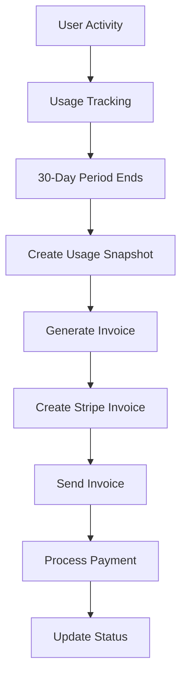

# Monthly Billing & Invoicing System

A comprehensive usage-based billing system for Lyceum that automatically charges users monthly based on their actual usage of licenses, clusters, and other resources.

## 🎯 Features

- **Usage-Based Billing**: Charges based on actual usage (licenses, clusters, users, storage)
- **Automated Monthly Invoicing**: Generates invoices every 30 days with detailed line items
- **Stripe Integration**: Secure payment processing with Stripe
- **Flexible Pricing**: Configurable pricing for different resource types
- **Invoice Management**: Complete invoice lifecycle from generation to payment
- **Usage Tracking**: Real-time usage monitoring and snapshots
- **Billing Dashboard**: User-friendly interface for viewing usage and invoices
- **Automated Billing**: Cron job for processing monthly billing batches
- **Webhook Integration**: Stripe webhooks for payment status updates

## 🏗️ Architecture

### Database Schema

**Core Tables:**
- `billing_periods` - 30-day billing cycles for each user
- `invoices` - Generated invoices with payment status
- `invoice_line_items` - Detailed breakdown of charges
- `billing_usage_snapshots` - Usage data captured at billing time
- `billing_automation_log` - Audit trail for billing processes

### Pricing Configuration

Located in `src/lib/flexible-pricing.ts`:

```typescript
export const PRICING_CONFIG = {
  basePlatformFee: 10,        // $10/month base
  licenses: {
    basic: 5,                 // $5/month per license
    professional: 15,         // $15/month per license  
    enterprise: 25,           // $25/month per license
  },
  clusters: {
    small: {
      development: 20,        // $20/month
      production: 40,         // $40/month
      analytics: 30,          // $30/month
    },
    // ... medium, large sizes
  },
  additionalUsers: 3,         // $3/month per extra user
  storageOverage: 0.10,       // $0.10/GB/month over limit
};
```

## 🚀 Setup Instructions

### 1. Database Setup

Run the billing schema creation:

```sql
-- Execute the SQL in Supabase SQL Editor
-- File: database-setup-monthly-billing.sql
```

Or use the API endpoint:

```bash
POST /api/billing/setup
Authorization: Bearer YOUR_ADMIN_TOKEN
```

### 2. Environment Variables

Add to your `.env.local`:

```bash
# Stripe Configuration
STRIPE_SECRET_KEY=sk_live_...
STRIPE_WEBHOOK_SECRET=whsec_...

# Cron Job Authentication
CRON_SECRET=your-secure-random-string

# Supabase (already configured)
NEXT_PUBLIC_SUPABASE_URL=...
SUPABASE_SERVICE_ROLE_KEY=...
```

### 3. Stripe Webhook Setup

Configure Stripe webhooks to point to:
```
https://yourdomain.com/api/billing/stripe-webhook
```

**Required Events:**
- `invoice.payment_succeeded`
- `invoice.payment_failed`
- `invoice.created`
- `invoice.finalized`
- `customer.subscription.created`
- `customer.subscription.updated`
- `customer.subscription.deleted`
- `payment_method.attached`

### 4. Automated Billing Setup

Set up a cron job to run monthly billing. Options:

**Vercel Cron (Recommended):**
```json
// vercel.json
{
  "crons": [
    {
      "path": "/api/billing/automated-billing",
      "schedule": "0 0 1 * *"
    }
  ]
}
```

**Manual Cron Job:**
```bash
# Run on the 1st of every month at midnight
0 0 1 * * curl -X POST https://yourdomain.com/api/billing/automated-billing \
  -H "Authorization: Bearer YOUR_CRON_SECRET"
```

## 📋 API Endpoints

### Billing Management

| Endpoint | Method | Description |
|----------|--------|-------------|
| `/api/billing/process-monthly` | POST | Process monthly billing for a user |
| `/api/billing/process-monthly` | GET | Get billing summary for a user |
| `/api/billing/setup` | POST | Initialize billing system |
| `/api/billing/setup` | GET | Check billing system status |

### Invoice Management

| Endpoint | Method | Description |
|----------|--------|-------------|
| `/api/billing/invoices` | GET | Get user invoices |
| `/api/billing/invoices` | POST | Create invoice (admin) |
| `/api/billing/invoices/[id]` | GET | Get invoice details |
| `/api/billing/invoices/[id]` | PATCH | Update invoice status |

### Usage Tracking

| Endpoint | Method | Description |
|----------|--------|-------------|
| `/api/billing/usage` | GET | Get current usage data |
| `/api/billing/usage` | POST | Create usage snapshot (admin) |

### Stripe Integration

| Endpoint | Method | Description |
|----------|--------|-------------|
| `/api/billing/stripe-webhook` | POST | Handle Stripe webhooks |
| `/api/billing/process-payment` | POST | Process invoice payment |
| `/api/billing/setup-subscription` | POST | Setup recurring billing |
| `/api/billing/setup-subscription` | DELETE | Cancel subscription |

### Automation

| Endpoint | Method | Description |
|----------|--------|-------------|
| `/api/billing/automated-billing` | POST | Run automated billing batch |
| `/api/billing/automated-billing` | GET | Get automation logs |

## 🎨 UI Components

### Billing Dashboard

Add to your app:

```tsx
import BillingDashboard from '@/components/billing/BillingDashboard';

export default function BillingPage() {
  return <BillingDashboard />;
}
```

**Features:**
- Current usage breakdown
- Estimated monthly cost
- Invoice history
- Payment status
- Usage analytics

## 🔄 Billing Process Flow

### 1. Monthly Billing Cycle



### 2. Automated Process

Every month (via cron):
1. Find billing periods past their end date
2. Create usage snapshots for each period
3. Generate invoices with line items
4. Create corresponding Stripe invoices
5. Process payments automatically
6. Update billing statuses
7. Create new billing periods

### 3. Payment Processing

1. Invoice created in system
2. Stripe invoice created with line items
3. Customer payment method charged
4. Webhook confirms payment
5. System invoice status updated
6. Next billing period begins

## 💰 Pricing Examples

### Basic User
- Platform Base Fee: $10.00
- 2 Basic Licenses: $10.00 (2 × $5)
- 1 Small Development Cluster: $20.00
- **Total: $40.00/month**

### Professional User  
- Platform Base Fee: $10.00
- 5 Professional Licenses: $75.00 (5 × $15)
- 2 Medium Production Clusters: $160.00 (2 × $80)
- 3 Additional Users: $9.00 (3 × $3)
- 5GB Storage Overage: $0.50 (5 × $0.10)
- **Total: $254.50/month**

### Enterprise User
- Platform Base Fee: $10.00
- 10 Enterprise Licenses: $250.00 (10 × $25)
- 3 Large Production Clusters: $480.00 (3 × $160)
- 2 Large Analytics Clusters: $240.00 (2 × $120)
- 10 Additional Users: $30.00 (10 × $3)
- **Total: $1,010.00/month**

## 🔍 Monitoring & Analytics

### Billing Health Check

```bash
GET /api/billing/setup
```

Returns:
- Table existence status
- User statistics
- Revenue metrics
- Recent billing activity

### Usage Analytics

```bash
GET /api/billing/usage?include_estimate=true
```

Returns:
- Current resource usage
- Estimated monthly cost
- Usage breakdown by category

### Automation Logs

```bash
GET /api/billing/automated-billing?limit=100
```

Returns:
- Billing automation history
- Success/error statistics
- Processing times

## 🚨 Error Handling

### Common Issues

1. **Missing Payment Method**
   - Prompt user to add payment method
   - Suspend services after grace period

2. **Payment Failures**
   - Retry payment with exponential backoff
   - Send notification emails
   - Mark invoice as overdue

3. **Usage Data Issues**
   - Fallback to previous period data
   - Manual usage correction APIs
   - Audit trail maintenance

### Monitoring Alerts

Set up alerts for:
- Failed billing processes
- Payment failures
- Unusual usage spikes
- System errors

## 🔐 Security Considerations

1. **API Authentication**: All endpoints require valid user tokens
2. **Admin Permissions**: Sensitive operations restricted to admins
3. **Stripe Integration**: Use Stripe's secure payment processing
4. **Data Encryption**: Sensitive data encrypted at rest
5. **Audit Trails**: Complete logging of all billing operations
6. **Webhook Verification**: Stripe webhook signatures verified

## 📧 Notifications (TODO)

Future email notifications:
- Invoice generated
- Payment successful
- Payment failed
- Usage alerts
- Billing changes

## 🧪 Testing

### Manual Testing

1. **Create Test User**
   ```bash
   POST /api/billing/setup-subscription
   ```

2. **Generate Test Invoice**
   ```bash
   POST /api/billing/process-monthly
   ```

3. **Process Test Payment**
   ```bash
   POST /api/billing/process-payment
   ```

### Automated Testing

Use Stripe's test mode:
- Test card numbers
- Webhook simulation
- Payment failure scenarios

## 📝 Maintenance

### Monthly Tasks
- Review billing automation logs
- Check for failed payments
- Verify usage data accuracy
- Update pricing if needed

### Quarterly Tasks
- Review pricing strategy
- Analyze usage patterns
- Optimize billing processes
- Update tax rates

## 🆘 Support

### Billing Issues
- Check automation logs
- Verify Stripe configuration
- Review usage snapshots
- Manual billing correction APIs

### User Support
- Invoice questions: Direct to billing dashboard
- Payment issues: Check Stripe customer portal
- Usage queries: Usage tracking APIs

---

The monthly billing system is now fully operational! 🎉

All components work together to provide automated, accurate, and transparent billing based on actual usage.


